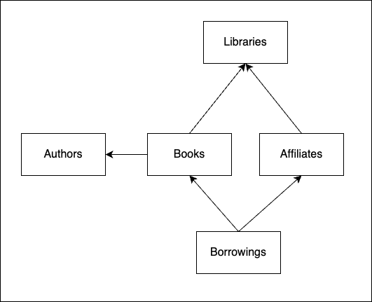
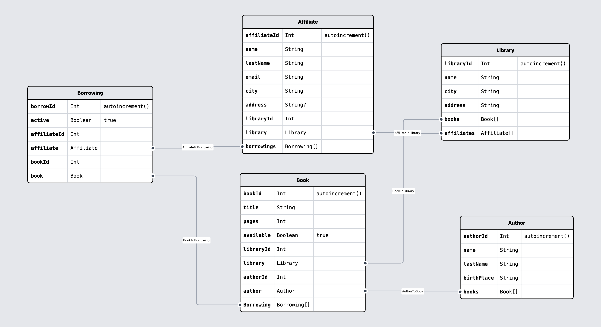

# Práctica 4 del Posgrado Full-Stack Web Technologies, por Ferran Bals

## Proyecto: Backend para una red de bibliotecas

### Acerca del autor

**Autor**: Ferran Bals Moreno

**Perfil de GitHub:** [franksparks](https://github.com/franksparks)

## Descripción de la práctica realizada

### Introducción

Se ha diseñado un modelo de datos para la gestión de una red de bibliotecas y los préstamos de libros a sus socios y se han implementado los endpoints para su gestión.

Diagrama del modelo de datos:

Modelo detallado por [Prismaliser](https://prismaliser.app/):

<b>Descripción de las entidades:</b>

- Las <u><b>bibliotecas</b></u> cuentan con socios (affiliates) y libros. Una biblioteca puede tener varios socios y varios libros.
- Un <u><b>socio</b></u> lo es de una biblioteca, y cuenta con x préstamos (tanto activos como inactivos).
- Un <u><b>libro</b></u> se encuentra en una biblioteca y está escrito por un autor, pero puede formar parte de varios préstamos (sólo 1 de ellos activo).
- Un <u><b>autor</b></u> puede haber escrito varios libros.
- Un <u><b>préstamo</b></u> relaciona el socio y el libro prestado.

<b>Notas:</b>

- Un socio no puede tener más de 3 libros en préstamo simultáneamente (préstamos activos).
- Un libro en préstamo no puede ser prestado a otro socio.

### Instrucciones

Para lanzar el modelo de datos debemos seguir los siguientes pasos:

1. Clonar el repositorio
2. Instalar las dependencias -> <code>bun install</code>
3. Lanzar el contenedor de Postgres -> <code>docker-compose -f docker/docker-compose.yml up -d</code>
4. Generar la base de datos mediante <code>bun x prisma db push</code>
5. Poblar la base de datos -> <code>bun x prisma db seed</code>

   Este comando inyectará:

   - 10 socios (<em>Affiliate</em>)
   - 5 autores (<em>Author</em>)
   - 25 libros (<em>Book</em>)
   - 10 préstamos (<em>Borrowing</em>)
   - 5 bibliotecas (<em>Library</em>)

6. Acceder a prisma studio -> <code>bun x prisma studio</code>

7. Ejecutar las llamadas a los endpoints cargando la [colección de Thunder Client proporcionada](./thunderClientCollection/pr4-backend-2024%20-%20Ferran%20Bals.json).

## Descripción de los endpoints proporcionados

### Affiliates

- <code>GET</code> <code><b>/affiliates</b></code> Obtiene todos los socios de todas las bibliotecas.
- <code>GET</code> <code><b>/affiliates/search</b></code> Permite buscar socios según su apellido.
- <code>GET</code> <code><b>/affiliates/id</b></code> Obtiene un socio a partir de su affiliateId.
- <code>POST</code> <code><b>/affiliates</b></code> Introduce un nuevo elemento socio.
- <code>PUT</code> <code><b>/affiliates/id</b></code> Actualiza la información de un socio.
- <code>DELETE</code> <code><b>/affiliates</b></code> No implementado.

### Authors

- <code>GET</code> <code><b>/authors</b></code> Obtiene todos los autores.
- <code>GET</code> <code><b>/authors/search</b></code> Permite buscar autores según su apellido.
- <code>GET</code> <code><b>/authors/id</b></code> Obtiene un libro a partir de su id.
- <code>POST</code> <code><b>/authors</b></code> Introduce un nuevo elemento autor.
- <code>PUT</code> <code><b>/authors/id</b></code> Actualiza la información de un autor.
- <code>DELETE</code> <code><b>/authors</b></code> No implementado.

### Books

- <code>GET</code> <code><b>/books</b></code> Obtiene todos los libros de todas las bibliotecas.
- <code>GET</code> <code><b>/books/search</b></code> Permite buscar socios según su título, authorId o librartyId.
- <code>GET</code> <code><b>/books/id</b></code> Obtiene un libro a partir de su id.
- <code>POST</code> <code><b>/books</b></code> Introduce un nuevo elemento libro.
- <code>PUT</code> <code><b>/books/id</b></code> Actualiza la información de un libro.
- <code>DELETE</code> <code><b>/books</b></code> No implementado.

### Borrowings

- <code>GET</code> <code><b>/borrowings</b></code> Obtiene todas los préstamos de todas las bibliotecas.
- <code>GET</code> <code><b>/borrowings/active</b></code> Obtiene todas los préstamos activos de todas las bibliotecas.
- <code>GET</code> <code><b>/borrowings/search</b></code> Permite buscar préstamos según su el libro a socio asociado.
- <code>GET</code> <code><b>/borrowings/active/search</b></code> Permite buscar préstamos activos según su el libro a socio asociado.
- <code>GET</code> <code><b>/borrowings/id</b></code> Obtiene un préstamo a partir de su id.

- <code>POST</code> <code><b>/borrowings</b></code> Introduce un nuevo elemento préstamo, si se cumplen las condiciones:
  - El libro no ha de estar ya en préstamo.
  - El socio no puede tener ya 3 préstamos activos.
- <code>PUT</code> <code><b>/borrowings/id</b></code> Endpoint para devolver libros,si se cumplen las condiciones:
  - El libro ha de estar en préstamo.
- <code>DELETE</code> <code><b>/borrowings</b></code> No implementado.

### Libraries

- <code>GET</code> <code><b>/libraries</b></code> Obtiene todas las bibliotecas.
- <code>GET</code> <code><b>/libraries/search</b></code> Permite buscar socios según su nombre.
- <code>GET</code> <code><b>/libraries/id</b></code> Obtiene una biblioteca a partir de su id.
- <code>POST</code> <code><b>/libraries</b></code> Introduce un nuevo elemento biblioteca.
- <code>PUT</code> <code><b>/libraries/id</b></code> Actualiza la información de una biblioteca.
- <code>DELETE</code> <code><b>/libraries</b></code> No implementado.

### Puntos de mejora

- Se podrían añadir fácilmente otras entidades, como los trabajadores de las bibliotecas u otros soportes para préstamos, como DVDs.

- Se podría almacenar el timestamp del préstamos y establecer un período de préstamo.

- Como consecuencia del punto anterior, se podría añadir un atributo adicional a los socios, "amonestado", que les impida pedir libros en préstamo si devuelven libros tarde.

- Se podría gestionar el préstamos de libros de bibliotecas que no son la del socio, generando un pedido a otra biblioteca con tales libros.

## Proveedor de Base de datos

Se ha configurado [CockroachDB](https://www.prisma.io/docs/guides/database/cockroachdb) como proveedor. Se han efectuado algunos cambios en el esquema de Prisma para poder utilizarlo. Al ser una solución en la nube ya no es necesario el archivo <code>docker-compose.yml</code>.

# Enunciado original

# Backend en Typescript, Express y Prisma

Se trata de hacer un _backend_ usando Typescript, Express y Prisma. El _backend_ implementado en clase es el modelo a seguir. Para alumnos que lo hacen por primera vez y sienten algo de incomodidad, lo ideal es usar el modelo de guía y hacer un _backend_ cercano al original de tal manera que la práctica sea un repaso a fondo. Para los que estén más cómodos, lo ideal es innovar en algun aspecto y salirse parcialmente del modelo en ciertos momentos o explorar algún interés personal. El modelo de datos es directamente la práctica anterior.

Al usar Prisma, es quizás buena idea explorar proveedores de Prisma que no sean precisamente Postgres, ya que el coste de hacerlo es mínimo (aunque esto no es obligatorio para nada). Aparte de los proveedores locales alternativos a Postgres, existen también opciones en la nube equivalentes a Postgres como [PlanetScale](https://www.prisma.io/docs/guides/database/planetscale), [CockroachDB](https://www.prisma.io/docs/guides/database/cockroachdb) o [Supabase](https://www.prisma.io/docs/guides/database/supabase), bien explicadas en la documentación de Prisma.

## Entregable

Como anteriormente, para hacer esta práctica hay que:

- Hacer un _fork_ de este repositorio.
- Trabajar en el _fork_ haciendo commits regularmente (una práctica que aparece entera en un solo commit tendrá una nota muy baja o cero, hay que mostrar todo el proceso intermedio).
- Al finalizar, se debe crear un `ZIP` del repositorio (que incluya el fichero `.env`!) y entregarlo en el [Campus Online de UPC School](https://talent.upc.edu) (habrá una tarea preparada para ello).

El entregable es el código del proyecto, incluyendo:

- `docker-compose.yml` si la base de datos corre bajo Docker.
- El código completo del servidor.
- Un fichero exportado de [Thunder Client](https://marketplace.visualstudio.com/items?itemName=rangav.vscode-thunder-client) con la lista de _endpoints_ que se han probado. (Esto es **extremadamente** relevante porque la corrección del backend, de no tener este fichero, es un trabajo muchísimo más tedioso!).
- Si se necesitan credenciales para acceder a servicios de cloud (o incluso localmente), es importante incluir en el ZIP del campus el fichero `.env` con éstas. Es muy importante no subir ese fichero en GitHub (es decir, incluirlo en `.gitignore`).
